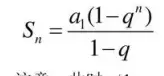

# Ch1

### 数据结构相关的基本概念

程序 = 数据结构+算法

软件 = 数据结构+算法+文件

数据结构是指数据元素的集合和他们的相互关系 有

1. 数据的逻辑结构
   1. 线性树形图形
2. 数据的存储结构
   1. 指针数组
3. 数据的操作
   1. 算法

### 面向对象的基本概念和原则

The Open-Closed Principle

对扩展开放

> 不要修改已有代码 尽量添加新的类并且覆写代码

对修改关闭

> 避免修改已经通过测试的代码

Subclass Substitution Rule

> 对父类而言的一切操作，对于子类来说也应保持一致且可行父类引用应该可以无 父类引用随意使用子类对象不会出错   cpp中不可以直接用子类对象初始化父类

Data-Abstraction Principle

> 只保留接口 实现细节抽象

### 编程基础（C++）

只保留提醒   默认值只应该在最后

> 引用 指针 数组是引用传递 其他是值传递  带&是引用带*是指针  不能混着 带&传入了一个指针对象就会出错  如果是数组的话形式参数是指针就行

继承 类名:被继承类,被继承类

虚函数 virtual 非虚函数不能重写

重写 override关键字

```cpp
void show() override{}
```

cpp不可以用子类对象初始化父类!  但是父类指针或者引用 可以指向子类对象 实现多态!     下面例子是引用

```cpp
void display(Base* obj) {
    obj->show();
}

int main() {
    Base base;
    Derived derived;
    display(&base);    // 输出 "Base show"
    display(&derived);
```

运算符重载语法

```cpp
类名 operator+ (const 类名& 对象名) const{
```

模板

`template<typename T>`

函数实现在类内 直接正常定义就好 不用任何template   只是参数类型带个T之类

如果实现在类外

```cpp
template <typename T>
返回类型 类名<T>::函数名(参数列表) {
    // 函数体
}
```

# Ch2

### 容器的基本概念

变量 存储多个元素的结合例如数组

### 基于连续结构（array）和链接结构（linked-list）实现基本的容器的原理

数组和链表咯

#### 等待实验: 实现数组和链表 迭代器 代码

### 迭代器的概念与迭代器的实现

一种对象 遍历容器元素 一般嵌套在类里 (像node)要实现比较== !=  后置递增++ 和* 解引用运算符的重载

```cpp
实验:待完成迭代器代码
```

# Ch3



### 算法时间复杂度的概念

算法执行时间和输入规模n增长的变化趋势 通常是最坏时间复杂度 动态数组和栈的时候看均摊   有时候会问加权平均

### 代码段和常见算法时间复杂度WorstTime(n)的计算

看递归有没有嵌套

1. 单层循环：O(n)
2. 两层嵌套循环：O(n²)
3. 三层嵌套循环：O(n³)
4. k层嵌套循环：O(n^k)

两个循环并列则复杂度是max(循环1,循环2) 看运算规模是不是会按照/2降低等等

归并排序nlogn 二分查找logn 冒泡排序n^2

注意nlogn的数量级>n

# Ch4

### 递归的基本概念、递归函数的基本形式和执行过程

汉诺塔

```cpp
void move(int n, char A, char B, char C) {
    if (n == 1) {
        // 基本情况：只有 1 个盘子
        cout << "Move disk 1 from " << A << " to " << B << endl;
    } else {
        // 第一步：将 n-1 个盘子从 A 移到 C（借助 B）
        move(n - 1, A, C, B);
        // 第二步：将第 n 个盘子从 A 移到 B
        cout << "Move disk " << n << " from " << A << " to " << B << endl;
        // 第三步：将 n-1 个盘子从 C 移到 B（借助 A）
        move(n - 1, C, B, A);
    }
}
```

### 简单递归算法的编程实现(实验汉诺塔 迷宫 二进制  回溯算法)

汉诺塔代码在上

#### *等待实现迷宫(回溯算法)*

### 递归的时间复杂度

例如汉诺塔:

因为每次递归(else)又多出来了两个新递归  这是*2 *2 指数增长的 所以时间复杂度为 $O(2^n)$ 指数级的

# Ch5 6 7

### vector向量 和 deque双端队列的定义和实现原理（逻辑结构和存储结构）

vector 逻辑结构:

动态数组 可以下标直接访问 并且可以自动扩容

存储结构:

```bash
start                finish               end_of_storage
  |                    |                        |
  v                    v                        v
+----+----+----+----+----+----+----+----+----+
| 1  | 2  | 3  | 4  |    |    |    |    |    |  
+----+----+----+----+----+----+----+----+----+
```

deque:

双端队列 也是线性表 但是在表头插入挺方便

存储结构:

Deque 可以被看作一系列分块存储的元素，每个块大小固定，通过一个中央的 **Map** 指针数组管理这些块：

```cpp
Map Array:      [Block 0] -> [Block 1] -> [Block 2] -> ...
Block 0:        [A, B, C, D]
Block 1:        [E, F, G, H]
Block 2:        [I, J, K, L]
```

### vector, deque 容器类的使用（声明对象，调用方法，存储元素）

```cpp
#include <iostream>
#include <vector>
#include <deque>
using namespace std;

int main() {
    // vector相关操作
    vector<int> v;            // 声明一个整型vector
    v.push_back(10);          // 在尾部插入元素10
    v.insert(v.begin(), 5);   // 在开头插入元素5
    int x = v.at(0);          // 安全访问第0个元素
    int y = v[1];             // 直接通过下标访问第1个元素
    v.pop_back();             // 删除尾部元素
    v.erase(v.begin());       // 删除指定迭代器位置元素
    cout << v.size() << endl; // 查询当前大小
    v.clear();                // 清空所有元素

    // deque相关操作
    deque<int> dq;            // 声明一个整型deque
    dq.push_back(10);         // 在尾部插入元素10
    dq.push_front(5);         // 在头部插入元素5
    int a = dq.at(0);         // 安全访问第0个元素
    int b = dq[1];            // 直接通过下标访问第1个元素
    dq.pop_back();            // 删除尾部元素
    dq.pop_front();           // 删除头部元素
    dq.insert(dq.begin(), 20);// 在开头插入元素20
    dq.erase(dq.begin()+1);   // 删除指定迭代器位置元素
    cout << dq.size() << endl;// 查询当前大小
    dq.clear();               // 清空所有元素

    return 0;
}

```

### 使用vector, deque实现特定的算法


| 操作              | `vector` 平均时间复杂度 | `vector` 最坏时间复杂度 | `deque` 平均时间复杂度 | `deque` 最坏时间复杂度 | 说明                                                                                                                                         |
| ----------------- | ----------------------- | ----------------------- | ---------------------- | ---------------------- | -------------------------------------------------------------------------------------------------------------------------------------------- |
| 插入（末尾）      | O(1)(摊销)              | O(n)                    | O(1)                   | O(n)                   | `vector` 平均情况下常数时间，扩展时需要移动数据。`deque` 也可能需要重新分配内存。 特殊: 一般说vector末尾插入的时间复杂度是平均  其他是最坏 |
| 删除（末尾）      | O(1)                    | O(1)                    | O(1)                   | O(1)                   | 常数时间。                                                                                                                                   |
| 插入/删除（前端） | O(n)                    | O(n)                    | O(1)                   | O(1)                   | `deque` 在前端操作更高效。                                                                                                                   |
| 随机访问          | O(1)                    | O(1)                    | O(1)                   | O(1)                   | 利用索引直接定位元素位置。                                                                                                                   |
| 插入/删除（中间） | O(n)                    | O(n)                    | O(n)                   | O(n)                   | 需要移动元素以腾出空间或填补空缺。                                                                                                           |

list queue stack   priority_queue

```cpp
#include <iostream>
#include <list>
#include <queue>
#include <stack>
#include <vector>

using namespace std;

int main() {
    // ------------------------
    // 1. std::list
    // ------------------------
    list<int> l;                   // 声明一个list
    l.push_back(10);               // 尾部插入10
    l.push_front(5);               // 头部插入5
    l.insert(++l.begin(), 20);     // 在第二个元素位置插入20
    l.pop_back();                  // 删除尾部元素
    l.pop_front();                 // 删除头部元素
    l.erase(l.begin());            // 删除指定迭代器位置元素
    cout << l.size() << endl;      // 获取当前大小
    l.clear();                     // 清空所有元素

    // ------------------------
    // 2. std::queue
    // ------------------------
    queue<int> q;                  // 声明一个queue
    q.push(10);                    // 入队一个元素10
    q.push(20);                    // 再入队一个元素20
    cout << q.front() << endl;     // 访问队头(10)
    cout << q.back() << endl;      // 访问队尾(20)
    q.pop();                       // 出队一个元素(10)
    cout << q.size() << endl;      // 队列大小
    cout << (q.empty() ? "empty" : "not empty") << endl; // 是否为空

    // ------------------------
    // 3. std::stack
    // ------------------------
    stack<int> s;                  // 声明一个stack
    s.push(10);                    // 压栈10
    s.push(20);                    // 压栈20
    cout << s.top() << endl;       // 查看栈顶(20)
    s.pop();                       // 弹栈(20)
    cout << s.top() << endl;       // 栈顶变为(10)
    cout << s.size() << endl;      // 栈大小
    cout << (s.empty() ? "empty" : "not empty") << endl; // 是否为空


// ------------------------
// 4. std::priority_queue
// ------------------------
priority_queue<int> maxHeap;       // 声明一个最大堆
maxHeap.push(10);                  // 插入元素10
maxHeap.push(5);                   // 插入元素5
maxHeap.push(20);                  // 插入元素20
cout << maxHeap.top() << endl;     // 访问堆顶元素(20)
maxHeap.pop();                     // 删除堆顶元素(20)
cout << maxHeap.size() << endl;    // 获取当前大小
cout << (maxHeap.empty() ? "empty" : "not empty") << endl; // 是否为空

// 使用自定义比较函数来创建最小堆
priority_queue<int, vector<int>, greater<int>> minHeap;
minHeap.push(10);                  // 插入元素10
minHeap.push(5);                   // 插入元素5
minHeap.push(20);                  // 插入元素20
cout << minHeap.top() << endl;     // 访问堆顶元素(5)
minHeap.pop();                     // 删除堆顶元素(5)
cout << minHeap.size() << endl;    // 获取当前大小
cout << (minHeap.empty() ? "empty" : "not empty") << endl; // 是否为空

    return 0;
}

```

insert约定是往前插入代码

##### list有一个哨兵节点形成环

哨兵节点的 `next` 和 `prev` 均指向自身。

```
[Header Node]
 prev -> Header Node <- next
```

#### 非空链表：

哨兵节点的 `next` 指向第一个节点，`prev` 指向最后一个节点。

```
[Header Node] <-----> [Node 1] <-----> [Node 2] <-----> [Node 3]
```

#### 栈应用:中缀表达式转换为后缀表达式的规则**

1. **操作数（Operands）**：
   * 如果是操作数，直接加入到后缀表达式中。
2. **左括号（`(`）**：
   * 遇到左括号时，将其压入栈。
3. **右括号（`)`）**：
   * 遇到右括号时，从栈中依次弹出运算符，直到遇到左括号。
   * 弹出左括号，但不加入后缀表达式。
4. **操作符（Operators）**：
   * 遇到操作符时：
     1. 如果栈为空，直接将操作符压入栈。
     2. 如果栈顶运算符的优先级高于或等于当前操作符，则弹出栈顶运算符，加入后缀表达式。(括号优先级最高然后是*/ 然后+-)
     3. 否则，将当前操作符压入栈。
5. **栈中剩余的操作符**：
   * 表达式处理完后，将栈中剩余的运算符依次弹出，加入后缀表达式。

例子:

$$


$$

#### 队列应用实验: 洗车

### 实验list实现的算法

# Ch7

### 容器适配器（container adapter）的概念和实现原理

```cpp
template <class T, class Container = deque<T>>
class stack {
protected:
    Container c;  // 底层容器
public:
    void push(const T& x) { c.push_back(x); }  // 插入到栈顶
    void pop() { c.pop_back(); }              // 删除栈顶元素
    T& top() { return c.back(); }             // 访问栈顶元素
    bool empty() const { return c.empty(); }  // 检查是否为空
    size_t size() const { return c.size(); }  // 返回元素数量
};
```

### queue(单项队列 FIFO)和 stack(LIFO)的定义和实现原理（逻辑结构和存储结构）

### queue, stack 容器类的使用（声明对象，调用方法，存储元素）

### 应用：使用queue, stack实现特定的算法：利用队列实现宽度排队，利用栈实现表达式的转换（infix->>postfix，prefix）、递归程序改写为非递归程序(迭代)

### 应用container adapter思想改造已有容器

# Ch8

### 二叉树（binary tree）的基本概念及相关概念（root, leaf, path, height, depth, child, parent…）

### 二叉树常见操作的递归实现（计算树中的节点数、叶子、树高…）

### 特殊二叉树的概念、性质及公式（two-tree, full-tree, complete-tree）

### 二叉树的遍历及操作的实现（pre-order, in-order, post-order, breadth-first）

### 二叉搜索树（binary search tree）的概念和实现原理（BinSearchTree class）

### 二叉搜索树的查找、插入、删除基本操作算法

二叉树常见的操作的递归实现-复习要求

> 递归算法通常以一个节点的递归方式表示一棵树
>
> 指针可以隐式转换为布尔值。当指针为`nullptr`时，它会被转换为`false`，否则转换为`true`。

### 计算树中节点数

递归公式

$$
节点总数 = 1 + 左子树节点总数 + 右子树节点总数
$$

```cpp
int couneNodes(TreeNode* root){
if (!root) return 0;
return 1 + countNodes(root->left)+ countNoes(root->right)
```

### 计算叶子节点数量

$$
= 左子树叶子节点数+ 右子树叶子节点数
$$

```cpp
int countLeaves(TreeNode* root){
if (!root) return0;//!root
if (!root->left && !root->right) return 1;
return countLeaves(root->left) + countLeaves(root->right)
```

### 计算树高

树高是根到最远叶子节点的高度

> 注意 空树高度是0 只有一个根节点的高度是 1 虽然根到根没有边

$$
树高 = 1 + max(左子树高,右子树高)
$$

这样子一层一层递归下去 每层加1 再加上上一层递归左右子树高最大值

~~~cpp
int height(TreeNode* root){
if (root!) return 0; //空树没边
return 1 + max(heifht(root->right)  height(root->left))
~~~

### 查找树的最大值

$$
max(根节点值,左子树最大,右子树最大)
$$

```cpp
int maxVal(TreeNode* root){
if(!root){return INT_MIN;}//如果为空 返回一个很小很小的数
return max(root->val,maxVal(root->left),root->right))
}
```

### 判断两棵树是否相同

相同 则:根节点值相同 左子树相同 右子树相同

```cpp
bool issame(TreeNode* p, TreeNode* q){//这是用根节点代表一个
if (!p && ! q) return true;//空当然相等
if (!p || ! q) return false;//因为是两个树 还要考虑一空一不空情况  当然是false
return ((p->val==q->val)&&issame(p->left,q->left)&&issame(p->right,q->right)) //使用&& 确保但凡出现一个false全都是false
}
```

### 判断是否为二叉搜索树

* 左子树所有节点值 < 根节点值。
* 右子树所有节点值 > 根节点值。
* 左右子树本身也是 BST。

~~~cpp
bool isBst(Node * node ,int min,int max){
if (node==nullptr) return false;
if (node->value <= min || node->value => max ){
return false}
return (isBst(node->left , min, node->value)&& isBst(node->right,node->value,max);//只有向左时更新最小值 只有向右时更新最大值
调用: Isbse(root,INT_MIN,INT_MAX);
~~~

# Ch9

### 平衡的二叉树的概念

### AVL树的基本概念

### 二叉树的四种旋转操作过程

# Ch10

### 红黑树(red-black tree)的基本概念

### 红黑树的查找、插入、删除操作过程

### 基于红黑树实现的4种容器类(map, set, multi-set, multi-map)的作用


`map`、`set`、`multiset` 和 `multimap` 基于**红黑树**来实现的。依靠红黑树的**平衡性**来保证 O(log n) 的平均操作复杂度。


| **容器**   | **键是否唯一** | **值是否唯一** | **键值对** | **用途**           |
| ---------- | -------------- | -------------- | ---------- | ------------------ |
| `map`      | 是             | 是             | 是         | 快速查找键值对     |
| `set`      | 是             | 是             | 否         | 存储唯一值         |
| `multimap` | 否             | 否             | 是         | 允许键重复的键值对 |
| `multiset` | 否             | 否             | 否         | 存储可以重复的值   |

### map, set 容器的声明和操作使用

# Ch11

### 优先级队列的概念和实现方式（基于堆）

### 堆的概念（上下有序的二叉树）和堆的存储实现（数组）

### 堆的插入、删除操作过程

# Ch13

### 哈希（hash）的概念和作用，哈希处理核心内容（哈希函数和冲突处理机制）

### 哈希冲突处理机制（链式哈希和开放地址哈希-双哈希）的原理
