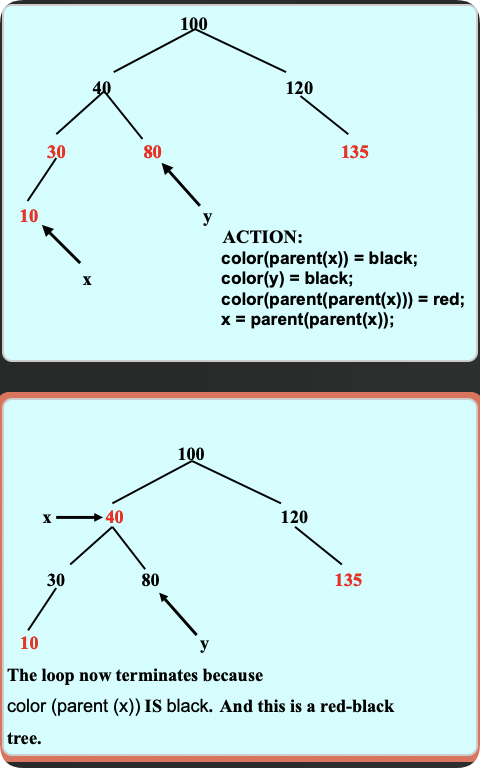
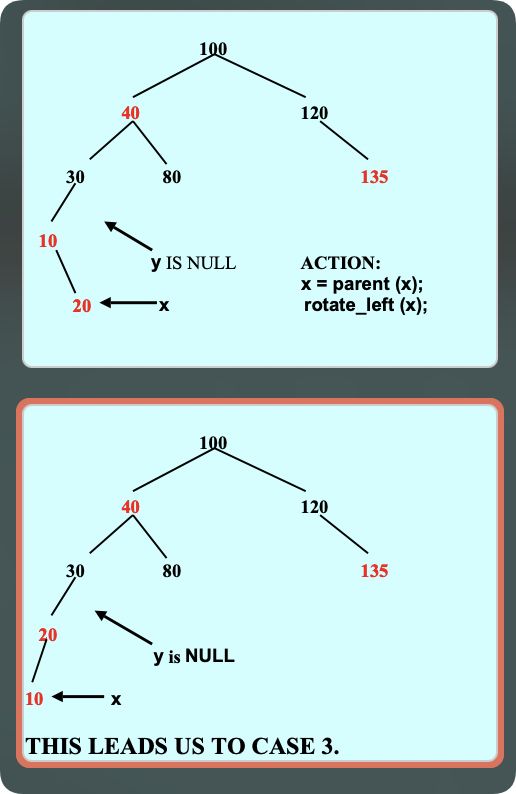
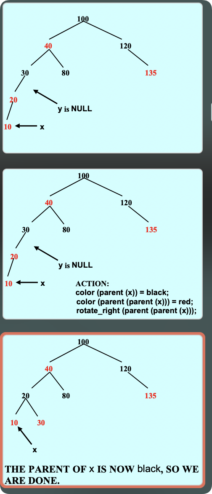

# 红黑树

红黑树是第二种平衡的二叉搜索树(第一种是avl树)

红黑树也是一种二叉搜索树与二叉搜索树的插入删除有关

红黑树不平衡时会旋转进行调整 与旋转有关

> 查找、插入和删除操作的时间复杂度为O(log n)。

### 红黑树的特点

根的颜色是黑色   其他每个节点的颜色是红色或者黑色

红黑树的所有性质可以简化为两条核心规则:

1. 红色规则:一个红色的节点不能有红色的孩子(红色的节点不能连续,红色节点的子节点是黑色)
2. 路径规则:从根到任何一个节点的*只有一个孩子*或*没有孩子*的节点的路径上的黑色节点的数量要相同

### 红黑树的旋转

旋转是为了符合红色规则和路径规则


> 左右树高不一定一样高 可能差的比较多

### 运算

查找运算直接使用二叉树即可  不需要修改

自增运算(迭代器)不需要修改

以上都是因为红黑树也是二叉搜索树

插入删除需要修改

`约定空节点的颜色默认是黑色`

#### 插入

`红黑树插入后的平衡调整情况`


让我结合之前讨论的三种情况，解释红黑树插入值v的五个操作步骤：

### 插入操作步骤

1. 创建新节点x
2. 设置节点x的值为v
3. 按BST方式插入并着为红色
4. 修复红色规则违反（根据三种情况）
   - **情况1**：如果叔叔节点是红色
     - 将父节点和叔叔节点变黑
     - 将祖父节点变红
     - 继续向上检查
     - 
   - **情况2**：叔叔节点黑色，当前节点是右子节点
     - 对父节点做左旋转
     - 转换为情况3处理
     - 
   - **情况3**：叔叔节点黑色，当前节点是左子节点
     - 改变父节点和祖父节点的颜色
     - 对祖父节点做右旋转
     - 
5. 确保根节点为黑色

这个修复过程主要处理因插入红节点可能导致的"连续红节点"问题，通过重新着色和旋转来维护红黑树的性质。路径规则（黑色节点数量）在插入时不会被破坏，因为我们插入的是红节点。


### 红黑树删除

---

### **红黑树删除操作的核心目标**

在红黑树中，删除一个节点后，需要确保树仍然满足红黑树的五条性质，以保持平衡性。这需要在删除操作后，通过适当的重新着色和旋转来调整树的结构。

### **删除操作的基本步骤**

1. **初始删除**：按照二叉搜索树（BST）的方式删除节点。
   - 如果被删除的节点有两个子节点，用它的后继节点（即右子树中的最小节点）替代它。
   - 被删除的节点要么是红色，要么是黑色。
2. **特殊情况处理**：如果被删除的节点是黑色，可能会破坏红黑树的性质，需要进行调整。

### **需要调整的情况**

当被删除的节点是黑色叶子节点，或者被删除的节点有两个子节点且替换节点是黑色叶子节点时，就需要进行额外的调整。这是因为删除一个黑色节点可能会导致红黑树的**黑高**（从根节点到叶子节点的黑色节点数量）不平衡。

### **调整思路**

- **定义节点 x 和 w**：
  - 令 `x` 为替代被删除节点的位置的节点（可能是一个 NIL 节点，视为黑色）。
  - 令 `w` 为 `x` 的兄弟节点（与 `x` 同父的另一子节点）。
- **目标**：
  - 通过重新着色和旋转，恢复红黑树的平衡性，确保所有路径上的黑色节点数量相同。
- **调整过程**：
  - 通过一个循环，不断调整树，直到满足红黑树的性质。循环的结束条件是 `x` 是红色节点，或者 `x` 是根节点。
  - 在循环中，根据 `x` 和 `w` 的情况，分类讨论，进行相应的处理。

### **四种情况（当 x 是左子节点时）**

1. **情况 1：w 是红色**

   - **现象**：`w` 节点为红色，`x` 为黑色节点。
   - **处理**：
     - 将 `w` 着色为黑色。
     - 将 `x` 的父节点着色为红色。
     - 对 `x` 的父节点进行左旋。
     - 这样处理后，新的兄弟节点 `w` 为黑色，转化为情况 2、3 或 4。
   - **目的**：将红色的兄弟节点转换为黑色，以便应用后面的情况。
2. **情况 2：w 是黑色，且 w 的两个子节点都是黑色**

   - **现象**：`w` 和 `w` 的子节点都是黑色。
   - **处理**：
     - 将 `w` 着色为红色。
     - 将 `x` 的父节点作为新的 `x`，向上继续检查。
   - **目的**：减少 `x` 所在路径上的黑色节点数，可能需要继续向上调整。
3. **情况 3：w 是黑色，w 的左子节点为红色，右子节点为黑色**

   - **现象**：`w` 是黑色，`w` 的左子节点为红色，右子节点为黑色。
   - **处理**：
     - 将 `w` 的左子节点着色为黑色。
     - 将 `w` 着色为红色。
     - 对 `w` 进行右旋。
     - 处理后，新的兄弟节点 `w` 满足情况 4。
   - **目的**：通过旋转，使得兄弟节点 `w` 的右子节点为红色，以便应用情况 4。
4. **情况 4：w 是黑色，且 w 的右子节点为红色**

   - **现象**：`w` 是黑色，`w` 的右子节点为红色。
   - **处理**：
     - 将 `w` 的颜色设置为 `x` 的父节点的颜色。
     - 将 `x` 的父节点着色为黑色。
     - 将 `w` 的右子节点着色为黑色。
     - 对 `x` 的父节点进行左旋。
     - 调整完成，退出循环。
   - **目的**：通过旋转和重新着色，平衡树的黑高，恢复红黑树的性质。

### **示例解析**

#### **示例 1：删除节点 40**

- **初始树**：
  ```
      50
     /  \
    40  70
          \
          120
  ```
- **操作**：
  - 删除节点 40，`x` 为 NIL 节点，`w` 为节点 70。
  - `w` 为黑色，`w` 的子节点中有红色节点，应用相应的调整策略。

#### **示例 2：删除节点 120（有两个子节点）**

- **初始树**：
  ```
       100
      /    \
     40    120
    /     /   \
   30    110  135
         /
        105
  ```
- **操作**：
  - 用后继节点 135 替换 120，被删除的节点是黑色，`x` 为 NIL，`w` 为节点 110。
  - 需要进行调整以恢复红黑树的性质。

#### **示例 3：删除节点 100（根节点）**

- **初始树**：
  ```
      100
     /    \
    40    120
   /  \
  30   80
  /
  10
  ```

**操作**：

- 用后继节点 120 替换 100，`x` 为 NIL，`w` 为节点 40。
- 需要调整以确保根节点为黑色，且红黑树的性质被维护。

### **调整的循环过程**

- **循环条件**：当 `x` 不是根节点，且 `x` 为黑色时，继续循环。
- **在循环中**：
- 根据 `x` 和 `w` 的颜色和子节点情况，选择上述四种情况之一进行处理。
- 处理后，可能需要更新 `x` 和 `w`，继续下一次循环。

### **调整结束**

- **循环结束条件**：`x` 为红色节点，或 `x` 为根节点。
- **操作**：将 `x` 着色为黑色。
- **结果**：红黑树的性质被恢复，删除操作完成。

### **时间复杂度分析**

- **最坏情况**：调整过程可能需要沿树向上遍历，全树高度为 `O(log n)`，因此最坏情况时间复杂度为 `O(log n)`。
- **平均情况**：大多数情况下，调整只需常数次操作，平均时间复杂度为 `O(1)`。
- **摊销时间复杂度**：由于红黑树的高效性，删除操作的摊销时间复杂度为 `O(1)`。

---

**总结**

红黑树删除操作复杂但有章可循，通过细致地分类讨论不同的情况，应用相应的旋转和重新着色操作，可以有效地维护红黑树的平衡性。理解每种情况的处理方法，有助于深入掌握红黑树的工作原理，确保在实际应用中正确地实现红黑树的删除操作。

## 例题


让我们详细分析删除节点40的情况，并展示每个步骤和相应的调整。

### 初始树结构

```
        40
       /  \
     30    60
    /  \   /  \
   20  35 50  80
  / \  / \
 10 25 32 37
```

### 删除节点40

1. **找到替换节点**：节点40有两个子节点，因此我们需要找到其后继节点来替换它。后继节点是右子树中的最小节点，即节点50。
2. **替换节点40**：用节点50替换节点40。

### 替换后的树结构

```
        50
       /  \
     30    60
    /  \     \
   20  35    80
  / \  / \
 10 25 32 37
```

### 调整过程

1. **删除节点40后，x和w的初始状态**：
   - `x` 是替换节点的位置，即节点50的位置。
   - `w` 是 `x` 的兄弟节点，即节点60。

### 四种情况的处理

#### 情况1：w是红色

- **现象**：`w` 节点为红色，`x` 为黑色节点。
- **处理**：
  - 将 `w` 着色为黑色。
  - 将 `x` 的父节点着色为红色。
  - 对 `x` 的父节点进行左旋。
  - 更新 `w` 为 `x` 父节点的右子节点。

在这个例子中，`w` 是黑色，所以不适用情况1。

#### 情况2：w是黑色，且w的两个子节点都是黑色

- **现象**：`w` 和 `w` 的子节点都是黑色。
- **处理**：
  - 将 `w` 着色为红色。
  - 将 `x` 指向其父节点，继续向上检查。

在这个例子中，`w` 的子节点80是红色，所以不适用情况2。

#### 情况3：w是黑色，w的左子节点为红色，右子节点为黑色

- **现象**：`w` 是黑色，`w` 的左子节点为红色，右子节点为黑色。
- **处理**：
  - 将 `w` 的左子节点着色为黑色。
  - 将 `w` 着色为红色。
  - 对 `w` 进行右旋。
  - 处理后，新的兄弟节点 `w` 满足情况4。

在这个例子中，`w` 的右子节点80是红色，所以不适用情况3。

#### 情况4：w是黑色，且w的右子节点为红色

- **现象**：`w` 是黑色，`w` 的右子节点为红色。
- **处理**：
  - 将 `w` 的颜色设置为 `x` 的父节点的颜色。
  - 将 `x` 的父节点着色为黑色。
  - 将 `w` 的右子节点着色为黑色。
  - 对 `x` 的父节点进行左旋。
  - 调整完成，退出循环。

在这个例子中，`w` 的右子节点80是红色，所以适用情况4。

### 调整后的树结构

```
        50
       /  \
     30    60
    /  \     \
   20  35    80
  / \  / \
 10 25 32 37
```

通过上述步骤，我们成功删除了节点40，并通过重新着色和旋转操作，确保红黑树的性质得以维护。
