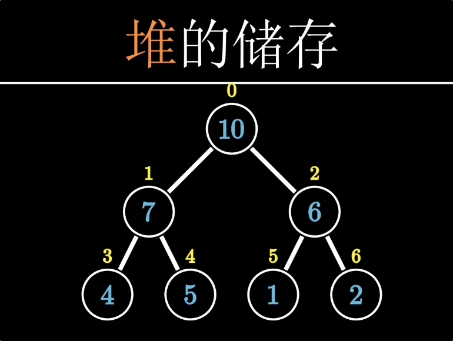

# 优先队列

是一种容器 按照特定优先级对元素排序

#### **1.1 优先队列的概念**

* **优先队列（Priority Queue）** 是一种特殊的队列：
  * 元素根据优先级排序，而不是按插入顺序。
  * 访问或删除的总是优先级最高的元素。
* **优先队列的特性**：
  1. **最高优先级优先**：`top` 方法返回优先级最高的元素。
  2. **动态调整**：插入新元素后，结构自动调整以保持顺序


#### **优先队列的实现方式（基于堆）**

* **最大堆实现**：
  * 底层通过 **二叉堆（Binary Heap）** 实现。
  * 最大堆保证根节点（堆顶）是整个堆中优先级最高的元素。
* **STL 的实现**：
  * `std::priority_queue` 是 C++ STL 中基于最大堆实现的优先队列。
  * 默认使用 `std::vector` 作为底层容器。

使用

```cpp
priority_queue<int> pq;
pq.push(10);
pq.push(20);
pq.push(5);
while (!pq.empty()) {
    cout << pq.top() << " ";
    pq.pop();
}
// 输出：20 10 5

```


## 2.堆的概念


### **2.1 堆的概念**

* 堆是一种特殊的 **完全二叉树**，满足以下特性：
  1. **最大堆**：每个节点的值大于等于其子节点的值。
  2. **最小堆**：每个节点的值小于等于其子节点的值。

### **2.2 堆的性质**

* **结构性**：
  * 堆必须是完全二叉树。
* **有序性**：
  * 最大堆(大根堆)：根节点是整个堆的最大值。
  * 最小堆(小根堆)：根节点是整个堆的最小值。

### **2.3 堆的存储实现（数组）**

堆通常用数组存储，以节省内存空间，避免显式指针操作。



> 是按层序给他们编号 又因为编号后有一定规律有下面的公式::


## 上浮下沉

https://www.bilibili.com/video/BV1AF411G7cA?t=128.7

违反大根堆:

* 条件：当前元素比父节点“大”（大根堆）。
* 过程：不断与父节点交换，向树的上层移动，直到满足堆序性质或到达根。 下沉反之

违反小根堆:


* **小根堆上浮**：若当前节点更“小”，就和父节点交换，直到堆序性质满足。
* **小根堆下沉**：若当前节点更“大”，就和更“小”的子节点交换，直到堆序性质满足。

## 堆的插入删除

#### **插入操作（`push_heap`）**

1. **目标**：
   * 将新元素插入堆中，同时保持堆的有序性。
2. **操作过程**：
   1. 将新元素插入到堆的末尾。

      > 1. 这是数组末尾! 就是最右下角
      >
   2. 从下往上调整堆，通过“上浮”操作将新元素移动到合适的位置。
   3. 时间复杂度为O(logn)

#### 删除


1. **目标**：
   * 删除堆顶元素，同时保持堆的有序性。
2. **操作过程**：
   1. 将堆顶元素与堆的最后一个元素交换。
   2. 移除堆的最后一个元素（删除堆顶）。
   3. 从上往下调整堆，通过“下沉”操作将堆顶元素移动到合适的位置。
3. **时间复杂度**：
   * 调整的时间复杂度为 O(log⁡n)O(\\log n)**O**(**lo**g**n**)。
