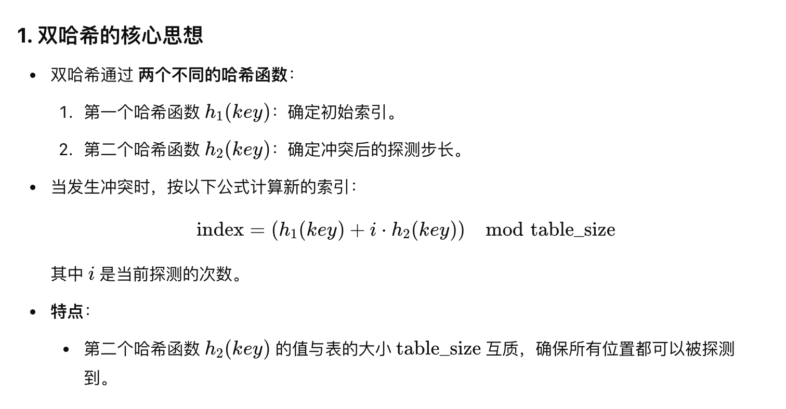

# 哈希

### 哈希函数

数据转化为固定大小整数值

相同的输入产生相同的输出 不同输入的数据尽量产生不同的哈希值

**哈希表（Hash Table）**：

* 哈希表是一种基于数组实现的数据结构，通过 **哈希函数** 将键映射到数组的索引位置。
* 它能够实现高效的数据插入、删除和查找，**平均时间复杂度为 O**(**1**)**。

#### **1.2 哈希表的作用**

* **高效的键值对存储**：
  * 适合需要频繁查找操作的场景，如数据库索引、缓存系统。
* **无序存储**：
  * 与有序数据结构（如红黑树）相比，哈希表的存储是无序的，但操作效率更高。

### **2. 哈希函数和冲突处理机制**

#### **2.1 哈希函数**

* **定义**：哈希函数是一种将任意大小的键映射到固定大小的整数范围内的算法。
* **要求**：
  1. **计算效率高**：快速计算出键的哈希值。
  2. **分布均匀**：尽量减少冲突，避免多个键映射到相同的索引。
  3. **确定性**：相同的键总是映射到相同的索引。

```cpp
unsigned long simple_hash(int key, int table_size) {
    return key % table_size;
}

```

#### 哈希冲突

* **冲突定义**：两个或多个不同的键通过哈希函数映射到相同的索引。
* **冲突的解决**：
  1. **链式哈希（Chaining）**：使用链表存储哈希冲突的键值对。
  2. **开放地址法（Open Addressing）**：
     * 通过探测空槽位解决冲突，包括线性探测、二次探测和双哈希。

### **3. 链式哈希（Chaining）**

#### **3.1 原理**

* 在哈希表的每个`桶（bucket）`中存储一个链表，所有映射到同一索引的键值对都存储在链表中。
* 当发生冲突时，将新键值对追加到链表末尾。

#### **3.2 数据结构**

* 每个桶存储一个链表
* ```cpp
  std::list<std::pair<int, std::string>> buckets[table_size];

  ```

#### **3.3 操作**

1. **插入**：
   * 计算键的哈希值，找到对应的桶。
   * 将新键值对插入链表。
2. **查找**：
   * 计算键的哈希值，在链表中线性搜索键值对。
3. **删除**：
   * 在链表中找到目标键值对并移除。

### **4. 开放地址法（Open Addressing）**

#### **4.1 原理**

* 当发生冲突时，不使用链表，而是通过探测找到下一个空槽位。
* 所有键值对存储在同一个数组中。

#### 4.2 探测方式


1. **插入**：

   * 计算键的哈希值，找到第一个空槽位插入键值对。
2. **查找**：

   * 按探测顺序查找目标键。
3. **删除**：

   * 标记槽位为“已删除”，以避免中断查找路径。

#### **4.4 优缺点**

* **优点**：
  * 避免使用链表，节省内存。
  * 查找性能优于链式哈希（当负载因子较低时）。
* **缺点**：
  * 插入失败时可能需要重哈希。
  * 探测序列可能导致 **聚簇问题（Clustering）**。


| **特性**     | **链式哈希**                 | **开放地址法**               |
| ------------ | ---------------------------- | ---------------------------- |
| **存储方式** | 数组中的每个桶存储链表       | 所有键值对存储在同一个数组中 |
| **冲突处理** | 使用链表存储冲突键值对       | 探测空槽位                   |
| **插入效率** | 高（不需要探测）             | 可能需要多次探测             |
| **查找效率** | 链表长度影响效率             | 负载因子影响效率             |
| **空间效率** | 较低（需要链表额外存储空间） | 较高                         |

---

### 开发地址法-双哈希探测



聚簇问题（Clustering Problem）是指在使用开放地址法处理哈希冲突时，多个键被哈希到相邻或相近的位置，导致这些位置形成“簇”（Cluster），从而影响哈希表的性能。聚簇问题会导致探测序列变长，增加插入和查找操作的时间复杂度。
