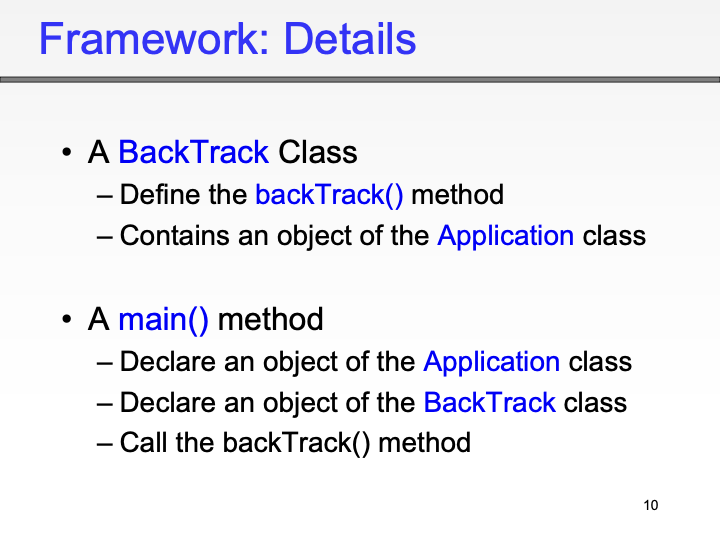
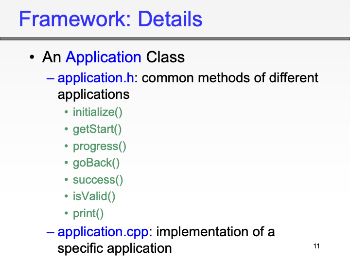
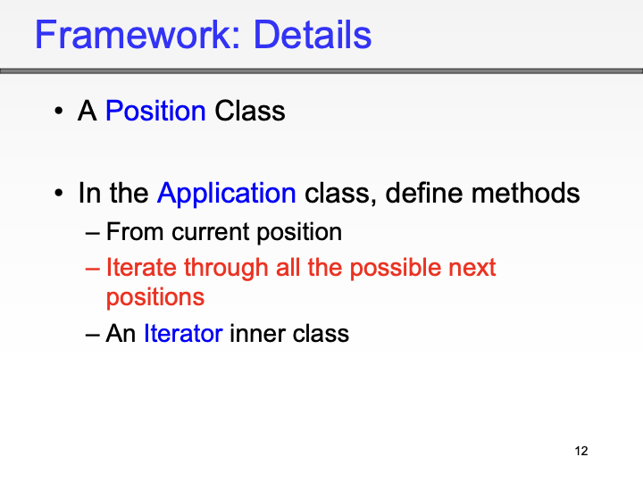
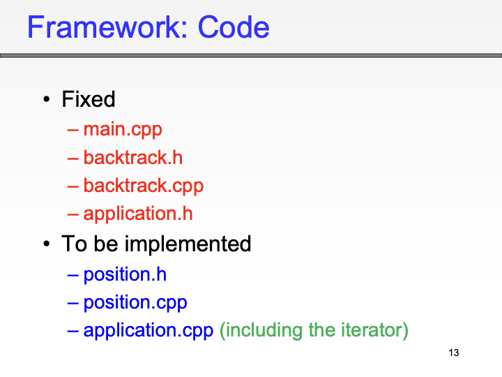

# 递归（recursive）

> 函数执行过程中调用自身

递归关键在于确保每次递归调用都使问题规模减小，并且最终达到基准情况递归要朝着结束的条件递归 不能无限调用

如果问题可以用递归解决那就可以用循环解决

#### 递归的一般形式

```cpp
if 最简形式
  // 直接解决

 else 
 //进行递归变成更简单的形式 
```

思路

1. 能不能直接解决的最简形式
2. 复杂的问题能不能变成更简单形式

#### 一个例子 求阶乘

阶乘 最简单的情况  0和1的阶乘是1  当n    != 1 时 n！= n x（n-1）

```cpp
long f(int n) {
    if (n == 1 || n == 0) {
        return 1;
    } else {
        return n * f(n - 1);
    }
}
```

> 求阶乘的时间复杂度是O（n）

空间复杂度： 每递归一次就多分配一个空间存储n，需要的空间和递归次数成正比 所以 空间复杂度也是（n）?

#### 另一个例子 十进制转换二进制

方法：除以2取余数

```cpp
int  f (int n) {
 if (n == 1 | n == 0 )
  cout << n;
 else {
  f(n/2);// 这里应该先写递归再写输出  因为2进制要让余数从最后面得输出 先递归是倒序输出 先输出是正序数
  cout << n % 2;
}
 }

```

时间复杂度:

每次调用会把问题规模减半 所以事件复杂度是$Olog(n)$

#### 汉诺塔问题

#### **递归解决方案**

1. 如果只有 1 个圆盘，则直接从 A 移到 B。
2. 如果有 n 个圆盘：
   * 将前 n−1(看做一个整体) 个圆盘从 A 移到 C（借助 B）。
   * 将第 n 个圆盘从 A 移到 B。
   * 将 n−1 个圆盘从 C 移到 B（借助 A）。

```cpp
// Precondition: n > 0
// Postcondition: 打印将 n 个盘子从 A 移到 B 的步骤
void move(int n, char A, char B, char C) {
    if (n == 1) {
        // 基本情况：只有 1 个盘子
        cout << "Move disk 1 from " << A << " to " << B << endl;
    } else {
        // 第一步：将 n-1 个盘子从 A 移到 C（借助 B）
        move(n - 1, A, C, B);
        // 第二步：将第 n 个盘子从 A 移到 B
        cout << "Move disk " << n << " from " << A << " to " << B << endl;
        // 第三步：将 n-1 个盘子从 C 移到 B（借助 A）
        move(n - 1, C, B, A);
    }
}

```

并没有实际存储汉诺塔问题的数据结构  我们只是让程序输出语言描述怎么移动

#### 时间复杂度

因为每次递归(else)又多出来了两个新递归  这是*2 *2 指数增长的 所以时间复杂度为 $O(2^n)$ 指数级的

# 回溯

## 迷宫问题

```cpp
#include <iostream>
using namespace std;

const int ROWS = 7, COLUMNS = 13;
int maze[ROWS][COLUMNS] = {
    {1, 1, 1, 0, 1, 1, 0, 0, 0, 1, 1, 1, 1},
    {1, 0, 1, 1, 1, 0, 1, 1, 1, 1, 1, 0, 1},
    {1, 0, 0, 0, 1, 0, 1, 0, 1, 0, 1, 0, 1},
    {1, 0, 0, 0, 1, 1, 1, 0, 1, 0, 1, 1, 1},
    {1, 1, 1, 1, 1, 0, 0, 0, 0, 1, 0, 0, 0},
    {0, 0, 0, 0, 1, 0, 0, 0, 0, 0, 0, 0, 0},
    {0, 0, 0, 0, 1, 1, 1, 1, 1, 1, 1, 1, 1}
};

bool solveMaze(int row, int col) {
    // 如果超出边界或碰到墙，返回 false
    if (row < 0 || col < 0 || row >= ROWS || col >= COLUMNS || maze[row][col] != 1) {
        return false;
    }
    // 如果到达终点，返回 true
    if (row == ROWS - 1 && col == COLUMNS - 1) {
        maze[row][col] = 9; // 标记路径
        return true;
    }
    // 标记当前路径
    maze[row][col] = 9;

    // 尝试四个方向
    if (solveMaze(row - 1, col) || // 向上
        solveMaze(row + 1, col) || // 向下
        solveMaze(row, col - 1) || // 向左
        solveMaze(row, col + 1)) { // 向右
        return true;
    }

    // 回溯，取消标记
    maze[row][col] = 2;
    return false;
}

int main() {
    if (solveMaze(0, 0)) {
        for (int i = 0; i < ROWS; i++) {
            for (int j = 0; j < COLUMNS; j++) {
                cout << maze[i][j] << " ";
            }
            cout << endl;
        }
    } else {
        cout << "No solution found!" << endl;
    }
    return 0;
}

```

### 时间复杂度:

最欢情况下所有位置都会被访问一次 访问次数是nXm

时间复杂度是O(n X m)

<!--  
## 例: n皇后问题

我们可以定义一个通用的 `Backtrack` 类和一个 `Iterator` 类，使其能够处理不同的应用问题。`Backtrack` 类将包含一个 `Application` 对象，该对象定义了具体的应用问题。`Iterator` 类将用于遍历可能的选择。

> n皇后问题是回溯法的应用，而解决方法中定义通用的 `Backtrack` 和 `Iterator` 类是为了面向对象考虑，这里构建了一个通用的回溯法框架，解决 n 皇后问题，演示了回溯法。

### 设计思路

1. **Application 类**：定义应用问题的接口，包括检查当前状态是否有效、记录解决方案、以及检查是否已经找到一个完整的解决方案的方法。
2. **Iterator 类**：用于遍历可能的选择。
3. **Backtrack 类**：包含一个 `Application` 对象，并使用 `Iterator` 类进行回溯搜索。

> Application 是问题，使用时 application 通过 `Backtrack` 类的构造函数把问题注册进来。

好的，我们将根据新的 `Application` 类接口（包括 `valid`、`record`、`done` 和 `undo` 方法）来修正整篇代码。

### 例: n皇后问题

我们可以定义一个通用的 `Backtrack` 类和一个 `Iterator` 类，使其能够处理不同的应用问题。`Backtrack` 类将包含一个 `Application` 对象，该对象定义了具体的应用问题。`Iterator` 类将用于遍历可能的选择。

> n皇后问题是回溯法的应用，而解决方法中定义通用的 `Backtrack` 和 `Iterator` 类是为了面向对象考虑，这里构建了一个通用的回溯法框架，解决 n 皇后问题，演示了回溯法。

### 设计思路

1. **Application 类**：定义应用问题的接口，包括检查当前状态是否有效、记录解决方案、检查是否已经找到一个完整的解决方案的方法，以及撤销上一步选择的方法。
2. **Iterator 类**：用于遍历可能的选择。
3. **Backtrack 类**：包含一个 `Application` 对象，并使用 `Iterator` 类进行回溯搜索。

> Application 是问题，使用时 application 通过 `Backtrack` 类的构造函数把问题注册进来。

### 示例：N 皇后问题

我们将以 N 皇后问题为例，展示如何使用这些类来实现回溯法。

#### Application 类

```cpp
class Application {
public:
    virtual bool valid(const vector<string>& board, int row, int col) const = 0;
    virtual void record(const vector<string>& board) = 0;
    virtual bool done(const vector<string>& board, int row) const = 0;
    virtual void undo(vector<string>& board, int row, int col) const = 0;
};
```

#### NQueensApplication 类

```cpp
class NQueensApplication : public Application {
public:
    NQueensApplication(int n) : n(n) {}

    bool valid(const vector<string>& board, int row, int col) const override {
        for (int i = 0; i < row; ++i) {
            if (board[i][col] == 'Q') return false;
        }
        for (int i = row - 1, j = col - 1; i >= 0 && j >= 0; --i, --j) {
            if (board[i][j] == 'Q') return false;
        }
        for (int i = row - 1, j = col + 1; i >= 0 && j < n; --i, ++j) {
            if (board[i][j] == 'Q') return false;
        }
        return true;
    }

    void record(const vector<string>& board) override {
        solutions.push_back(board);
    }

    bool done(const vector<string>& board, int row) const override {
        return row == n;
    }

    void undo(vector<string>& board, int row, int col) const override {
        board[row][col] = '.';
    }

    const vector<vector<string>>& getSolutions() const {
        return solutions;
    }

private:
    int n;
    vector<vector<string>> solutions;
};
```

> 这两步的理解：如果是 Java，`Application` 就是接口类，`NQueensApplication` 类就是实现这个接口的。

#### Iterator 类

```cpp
class Iterator {
public:
    Iterator(int n) : n(n), col(0) {}

    bool hasNext() const {
        return col < n;
    }

    int next() {
        return col++;
    }

private:
    int n;
    int col;
};
```

#### Backtrack 类

```cpp
class Backtrack {
public:
    Backtrack(Application& app) : app(app) {}

    void solve(vector<string>& board, int row) {
        if (app.done(board, row)) {
            app.record(board);
            return;
        }

        Iterator it(board.size());

        while (it.hasNext()) {
            int col = it.next();
            if (app.valid(board, row, col)) {
                board[row][col] = 'Q';
                solve(board, row + 1);
                app.undo(board, row, col);  // 撤销选择
            }
        }
    }

private:
    Application& app;
};
```

#### 主函数

```cpp
int main() {
    int n = 4;
    NQueensApplication app(n);
    Backtrack backtrack(app);

    vector<string> board(n, string(n, '.'));
    backtrack.solve(board, 0);

    const auto& solutions = app.getSolutions();
    for (const auto& solution : solutions) {
        for (const auto& row : solution) {
            cout << row << endl;
        }
        cout << endl;
    }

    return 0;
}
```

### 解释

1. **Application 类**：定义了应用问题的接口。如果是 Java，`Application` 就是接口类，`NQueensApplication` 类就是实现这个接口的。
2. **NQueensApplication 类**：实现了 N 皇后问题的具体应用，包括检查当前状态是否有效、记录解决方案、检查是否已经找到一个完整的解决方案的方法，以及撤销上一步选择的方法。
3. **Iterator 类**：用于遍历可能的选择。
4. **Backtrack 类**：包含一个 `Application` 对象，并使用 `Iterator` 类进行回溯搜索。
5. **主函数**：创建 `NQueensApplication` 和 `Backtrack` 对象，并调用 `solve` 方法解决问题。

通过这种设计，我们可以将回溯法应用于不同的问题，只需实现不同的 `Application` 类即可。-->

## 折半查找

要求数组必须有序

#### 核心思想

是通过比较中间元素来决定下一步的查找范围：

* 如果中间元素等于目标值，则查找成功。
* 如果中间元素小于目标值，则目标值只能在中间元素的右侧。
* 如果中间元素大于目标值，则目标值只能在中间元素的左侧。

时间复杂度 O(log)

### 迭代实现

```cpp
#include <iostream>
#include <vector>

int binarySearch(const std::vector<int>& arr, int target) {
    int low = 0;
    int high = arr.size() - 1;

    while (low <= high) {
        int mid = low + (high - low) / 2;

        if (arr[mid] == target) {
            return mid; // 找到目标值，返回索引
        } else if (arr[mid] < target) {
            low = mid + 1; // 目标值在右侧
        } else {
            high = mid - 1; // 目标值在左侧
        }
    }

    return -1; // 未找到目标值
}

int main() {
    std::vector<int> arr = {1, 2, 3, 4, 5, 6, 7, 8, 9, 10};
    int target = 7;
    int result = binarySearch(arr, target);

    if (result != -1) {
        std::cout << "目标值 " << target << " 的索引为 " << result << std::endl;
    } else {
        std::cout << "目标值 " << target << " 未找到" << std::endl;
    }

    return 0;
}
```

### 递归实现

```cpp
int binarySearchRecursive(const std::vector<int>& arr, int low, int high, int target) {
    if (low > high) {
        return -1; // 未找到目标值
    }

    int mid = low + (high - low) / 2;

    if (arr[mid] == target) {
        return mid; // 找到目标值，返回索引
    } else if (arr[mid] < target) {
        return binarySearchRecursive(arr, mid + 1, high, target); // 目标值在右侧
    } else {
        return binarySearchRecursive(arr, low, mid - 1, target); // 目标值在左侧
    }
}

```

1. **迭代实现**：使用 `while` 循环逐步缩小查找范围，直到找到目标值或查找范围为空。
2. **递归实现**：使用递归函数逐步缩小查找范围，直到找到目标值或查找范围为空。
3.

递归和回溯解决问题的通用想法

•An initial configuration（初始格局）

•A start position（开始位置）

•Make process（前进）

•Go back to a previous position（后退）

•Try another possible choice（更换选择）

•Success（成功）








