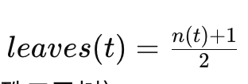
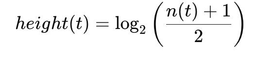
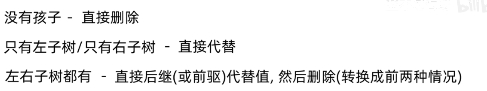

# 二叉树

二叉树是一种树形数据结构，其中每个节点最多有两个子节点，通常称为左子节点和右子节点。二叉树的结构使其在许多算法和数据结构中非常有用，特别是在搜索、排序和表达式解析等领域。

### 二叉树的基本概念

1. **节点（Node）**：二叉树的基本单元，每个节点包含一个值和两个指向子节点的引用。
2. **根节点（Root）**：树的顶端节点，没有父节点。
3. **叶节点（Leaf）**：没有子节点的节点。
4. **子节点（Child）**：一个节点的直接后继节点。
5. **父节点（Parent）**：一个节点的直接前驱节点。
6. **左子节点（Left Child）**：一个节点的左侧子节点。
7. **右子节点（Right Child）**：一个节点的右侧子节点。
8. ***高度（Height*）**：从根节点到最远叶子节点路径上的边数。
9. ***深度（Depth）***：从根节点到该节点的路径上的边数。



> nt是节点数

## 二叉树类型

### 空树（Empty Tree）

空树是指没有任何节点的树。它是二叉树的一种特殊情况，通常用于表示树的结束或初始化状态。


1. **空树的高度**：空树的高度通常定义为 `-1` 或 `0`，具体取决于使用的定义。常见的定义是将空树的高度定义为 `-1`，因为这使得递归定义更加一致。
2. **只有一个根节点的树的高度**：只有一个根节点的树的高度为 `0`，因为根节点没有子节点。

### 满二叉树（Full Binary Tree）

满二叉树是一种特殊的二叉树，其中每个节点要么有两个子节点，要么没有子节点。换句话说，所有的非叶子节点都有两个子节点，所有的叶子节点都在同一层次上。

#### 特点：

> 1. 每一层的节点数都是最大值。
> 2. 如果满二叉树的高度为 `h`，则节点总数为 $2^h - 1$。
> 3. 如果为满二叉树  高度为

### 完全二叉树（Complete Binary Tree）

完全二叉树是一种二叉树，其中除了最后一层，所有层都是满的，并且最后一层的节点尽可能靠左排列。

#### 特点：

1. 从根节点到倒数第二层，所有层都是满的。
2. 最后一层的节点从左到右依次排列，没有空缺。

### 平衡二叉树（Balanced Binary Tree）

平衡二叉树是一种二叉树，其中任何节点的两个子树的高度差不超过1。平衡二叉树的目的是保持树的高度尽可能低，从而提高操作的效率。

#### 特点：

1. 任意节点的左右子树高度差不超过1。
2. 常见的平衡二叉树有AVL树和红黑树。

### 二叉搜索树（Binary Search Tree, BST）

二叉搜索树是一种特殊的二叉树，其中每个节点的左子树的所有节点值都小于该节点值，右子树的所有节点值都大于该节点值。

#### 特点：

1. 左子树的所有节点值小于根节点值。
2. 右子树的所有节点值大于根节点值。
3. 中序遍历二叉搜索树可以得到一个递增的有序序列。

这个示例展示了如何创建满二叉树、完全二叉树和二叉搜索树。

# 二叉搜索树

二叉搜索树是一种特殊的二叉树，其中每个节点的左子树的所有节点值都小于该节点值，右子树的所有节点值都大于该节点值。

二叉搜索树与满二叉树、完全二叉树 等没有直接关系

`每一个子树都是如此`

### 特点

从左到右有序 ----`一定存在最小的元素在最左  一定存在的最大的元素在最右`

* > * BST，插入、查找和删除操作的时间复杂度都是O(log n)。
  >

### 实现二叉搜索树

关联容器-元素的位置取决于它与已存在的元素的关系    不取决于放入先后 时间

```cpp
class BinSearchTree{
  peivate:
    unsigned size() const;
iterator search()// 平均 O(log n) 最坏O(n)
iterator insert(const T& item)//不需要位置 平均时间复杂log 最坏O(n)
void delete//平均时间复杂度常量  最坏On
//以上  最换的情况都是所有节点都在一个直线上
iterator end()   //end返回的是最大的元素的迭代器
iterator begin() //注意begin返回的是最小元素的迭代器
~BinSearchTree()//析构器
}
```

### 插入元素的步骤

所有的元素都可以放入二叉搜索树

1. 从根节点开始。
2. 如果树是空的，则新节点作为根节点。
3. 否则，比较新节点的值与当前节点的值：
   * 如果新节点的值小于当前节点的值，递归地在左子树插入。
   * 如果新节点的值大于当前节点的值，递归地在右子树插入。

### 实现删除二叉搜索树指定元素

1. 删除的是叶子或者只有一个孩子 不需要对下面的关系进行调整
2. 删除的是有两个汉字的节点 取后继(比删除节点大一点的,`右子树中最左的元素`)   代替原删除元素的位置     然后删掉那个原来的后继元素
   `二叉搜索树的删除中 真正删除的节点总是没有孩子或者只有一个孩子`

## 二叉树常见的操作的递归实现-复习要求

> 递归算法通常以一个节点的递归方式表示一棵树
>
> 指针可以隐式转换为布尔值。当指针为`nullptr`时，它会被转换为`false`，否则转换为`true`。

### 计算树中节点数

递归公式

$$
节点总数 = 1 + 左子树节点总数 + 右子树节点总数
$$

```cpp
int couneNodes(TreeNode* root){
if (!root) return0;
return 1 + countNodes(root->left)+ countNoes(root->right)
```

### 计算叶子节点数量

$$
= 1左子树叶子节点数+ 右子树叶子节点数
$$

```cpp
int countLeaves(TreeNode* root){
if (!root) return0;//!root
if (!root->left && !root->right) return 1;
return countLeaves(root->left) + countLeaves(root->right)
```

### 计算树高

树高是根到最远叶子节点的高度

> 注意 空树高度是0 只有一个根节点的高度是 1 虽然根到根没有边

$$
树高 = 1 + max(左子树高+右子树高)
$$

这样子一层一层递归下去 每层加1 再加上上一层递归左右子树高最大值

~~~cpp
int height(TreeNode* root){
if (root!) return 0; //空树没边
return 1 + max(heifht(root->right)  height(root->left))
~~~

### 查找树的最大值

$$
max(根节点值,左子树最大,右子树最大)
$$

```cpp
int maxVal(TreeNode* root){
if(!root){return INT_MIN;}//如果为空 返回一个很小很小的数
return max(root->val,maxVal(root->left),root->right))
}
```

### 判断两棵树是否相同

相同 则:根节点值相同 左子树相同 右子树相同

```cpp
bool issame(TreeNode* p, TreeNode* q){//这是用根节点代表一个
if (!p && ! q) return true;//空当然相等
if (!p || ! q) return false;//因为是两个树 还要考虑一空一不空情况  当然是false
return ((p->val==q->val)&&issame(p->left,q->left)&&issame(p->right,q->right)) //使用&& 确保但凡出现一个false全都是false
}
```

### 判断是否为二叉搜索树

* 左子树所有节点值 < 根节点值。
* 右子树所有节点值 > 根节点值。
* 左右子树本身也是 BST。

~~~cpp
bool isBst(Node * node ,int min,int max){
if (node==nullptr) return false;
if (node->value <= min || node->value => max ){
return false}
return (isBst(node->left , min, node->value)&& isBst(node->right,node->value,max);//只有向左时更新最小值 只有向右时更新最大值
调用: Isbse(root,INT_MIN,INT_MAX);
~~~

### **为什么二叉树递归操作的时间复杂度是 O(n)O(n)**O**(**n**)**

在递归操作（如节点计数、叶子计数、树高计算等）中，我们需要遍历二叉树的

## 二叉树遍历

#### **1.1 前序遍历（Pre-Order Traversal）**

* 遍历顺序：**根 -> 左子树 -> 右子树**
* 常用于复制树或表达式树的前缀表达式。

#### **1.2 中序遍历（In-Order Traversal）**

* 遍历顺序：**左子树 -> 根 -> 右子树**
* 常用于输出排序的节点值（如果是二叉搜索树）。

#### **1.3 后序遍历（Post-Order Traversal）**

* 遍历顺序：**左子树 -> 右子树 -> 根**
* 常用于删除树或计算表达式树的值。

#### **1.4 广度优先遍历（Breadth-First Traversal，层序遍历）**

* 遍历顺序：按层次逐层遍历，从上到下，从左到右。
* 首先访问根节点。
* 然后从左到右依次访问根节点的子节点。
* 接着从左到右依次访问根节点的孙节点，依此类推，直到访问完所有节点。

遍历
void preOrderTraversal(TreeNode* root) {
if (!root) return;
cout << root->val << " ";         // 访问根节点
preOrderTraversal(root->left);    // 遍历左子树
preOrderTraversal(root->right);   // 遍历右子树
}
void inOrderTraversal(TreeNode* root) {
if (!root) return;
inOrderTraversal(root->left);     // 遍历左子树
cout << root->val << " ";         // 访问根节点
inOrderTraversal(root->right);    // 遍历右子树
}
void postOrderTraversal(TreeNode* root) {
if (!root) return;
postOrderTraversal(root->left);   // 遍历左子树
postOrderTraversal(root->right);  // 遍历右子树
cout << root->val << " ";         // 访问根节点
}

## **二叉搜索树的查找、插入、删除基本操作算法**

### 1. **查找操作（`find` 方法）**

**目标**：查找树中是否包含某个元素，并返回指向该元素的迭代器。

#### 算法描述

* **初始状态**：

  * 用两个指针：`parent` 指向树的头节点（`header`），`child` 指向根节点（`header->parent`）。
    > * 头节点是二叉搜索树的一种辅助节点，专门用于管理树的元信息（如指向最小和最大节点的指针）以及方便迭代器操作。
    >
* **遍历树**：

  * 如果 `child` 的值大于等于目标值 `item`：
    * 将 `parent` 更新为当前的 `child`。
    * 将 `child` 移动到其左子节点。
  * 否则：
    * 将 `child` 移动到其右子节点。
* **终止条件**：

  * 遍历到叶子节点（`child` 为 `NULL`）。
  * 若 `parent` 的值等于 `item`，则找到目标值，返回指向 `parent` 的迭代器。
  * 否则，返回树尾迭代器（`end()`）。

#### 示例

* 查找值 `60` 的过程（树结构见 PDF）：
  * 初始状态：`parent = header`，`child = 80`。
  * 比较 `80 > 60`，更新：`parent = 80`，`child = 40`。
  * 比较 `40 < 60`，更新：`parent = 40`，`child = 60`。
  * 找到 `60`，返回指向 `60` 的迭代器。

#### 时间复杂度

* **平均情况**：O(log⁡n))。
* **最坏情况**：O(n)，当树退化为链表。

```cpp
Iterator find(const T& item) {
    Link parent = header;
    Link child = header->parent;
  
    while (child != NULL) {
        if (!(child->item < item)) {
            parent = child;
            child = child->left;
        } else {
            child = child->right;
        }
    }
  
    if (parent == header || item < parent->item) {
        return end();
    } else {
        return parent; // automatic type casting
    }
} // find
```

### 2. **插入操作（`insert` 方法）**

**目标**：将新元素插入树中，并保持二叉搜索树的性质。

#### 算法描述

* **初始检查**：
  * 如果树为空（`header->parent == NULL`），直接插入为根节点。
* **遍历树**：
  * 使用 `parent` 和 `child` 指针遍历树，类似 `find` 方法。
  * 找到目标插入位置：
    * 如果 `item < parent->item`：插入到 `parent` 的左子节点。
    * 否则：插入到 `parent` 的右子节点。
* **更新头节点**：
  * 如果插入的是当前最小值或最大值，更新 `header->left` 或 `header->right` 指针。

#### 示例

* 插入值 `73` 的过程（树结构见 PDF）：
  * 初始状态：`parent = header`，`child = 80`。
  * 比较 `80 > 73`，更新：`parent = 80`，`child = 40`。
  * 比较 `40 < 73`，更新：`parent = 40`，`child = 60`。
  * 比较 `60 < 73`，更新：`parent = 60`，`child = 75`。
  * 比较 `75 < 73`，最终插入到 `75` 的左子节点。

#### 时间复杂度

* **平均情况**：O(log⁡n)O(\\log n)**O**(**lo**g**n**)。
* **最坏情况**：O(n)O(n)**O**(**n**)，当树退化为链表。

### 

~~~cpp
Iterator insert (const T& item)
{
 if (header -> parent == NULL)
{
 insertLeaf (item, header, header -> parent);
// adjust header -> left and right, return header -> parent
 } // inserting at tree's root
 else
{
 Link parent = header,
 child = header -> parent;
 while (child != NULL)
{
 parent = child;
 if (item < child -> item)
 child = child -> left;
 else
 child = child -> right;
} // while 
if (item < parent -> item)
{
 insertLeaf (item, parent, parent -> left);
 if (header -> left == parent) // parent -> item was
 // smallest item
 header -> left = parent -> left;
return parent -> left;
 } // insert at left of parent
 else
{
 insertLeaf (item, parent, parent -> right);
 if (header -> right == parent) // parent -> item was
 // largest item
 header -> right = parent -> right;
 return parent -> right;
 } // insert at right of parent
 } // tree not empty
} // insert
~~~

### 3. **删除操作（`erase` 方法）**

**目标**：从树中移除指定的节点，同时保持二叉搜索树的性质。

#### 算法描述



删除操作有三种情况：

1. **节点无子节点（叶子节点）**：
   * 直接从树中移除该节点。
   * 更新其父节点的左或右指针。
2. **节点有一个子节点**：
   * 用子节点替代被删除的节点。
   * 更新其父节点的左或右指针。
3. **节点有两个子节点**：
   * 用被删除节点的 **中序遍历后继节点（右子树的最左节点）** 或 **前驱节点（左子树的最右节点）** 替代被删除的节点。

     > * 左子树最大的或者右子树最小的
     >
   * 然后递归删除替代节点（后继或前驱）。

#### 示例

* 删除节点 `80` 的过程（树结构见 PDF）：
  * 节点 `80` 有两个子节点（`60` 和 `110`）。
  * 找到后继节点 `85`（`80` 的右子树中的最左节点）。
  * 用 `85` 替代 `80`，然后删除节点 `85`。

#### 时间复杂度

* **平均情况**：O(log⁡n)O(\\log n)**O**(**lo**g**n**)。
* **最坏情况**：O(n)O(n)**O**(**n**)，当树退化为链表。

```cpp
void erase(Iterator itr) {
    if (itr.link->parent->parent == itr.link) { // itr positioned at root node
        deleteLink(itr.link->parent->parent);
    } else if (itr.link->parent->left == itr.link) { // itr positioned at a left child
        deleteLink(itr.link->parent->left);
    } else {
        deleteLink(itr.link->parent->right);
    }
} // erase
```
