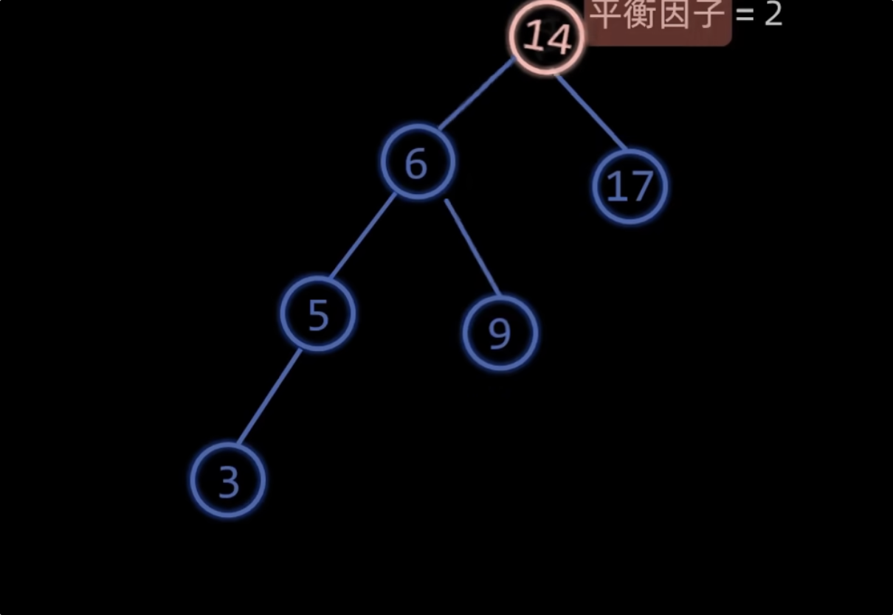
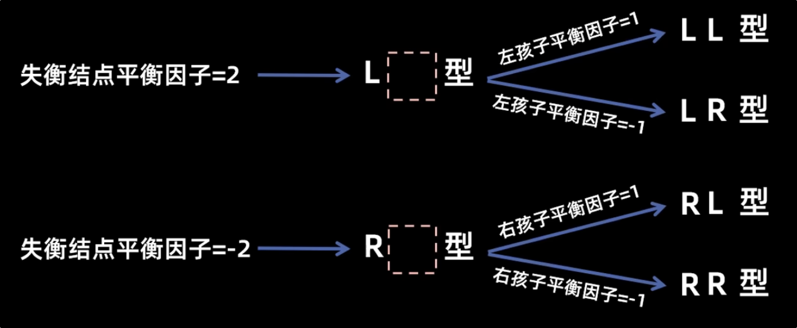
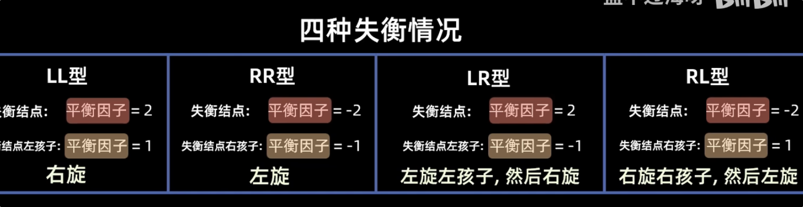

# avl树

AVL树是一种自平衡二叉搜索树（BST），其特点是每个节点的左右子树的高度差（平衡因子）最多为1。AVL树通过在插入和删除节点时进行旋转操作来保持树的平衡，从而保证了查找、插入和删除操作的时间复杂度为O(log n)。

### AVL树的特点：

1. **平衡因子**：每个节点的平衡因子是其左子树高度减去右子树高度。AVL树要求每个节点的平衡因子的绝对值不超过1。

   > 1. 注意是左-右!
   >
2. **旋转操作**：为了保持平衡，AVL树在插入和删除节点时可能需要进行旋转操作。旋转分为四种类型：

#### 仅旋转规则

冲突的左孩变右孩子

冲突的右孩变左孩

### 失衡情况

> 插入只用看插入节点那部分是否失衡

> 删除需要沿着祖先依次向上检查和调整

https://www.bilibili.com/video/BV1tZ421q72h

LL旋转 单右旋 ：用于失衡节点左子树的左子树插入导致的不平衡。

> 对失衡节点进行右旋
>

**LR旋转 左-右旋**：用于左子树的右子树插入导致的不平衡。

> 左旋(失衡节点)左孩子 然后自己右旋
>

**RR旋转 单左旋**：用于右子树的右子树插入导致的不平衡。

**RL旋转 右-左旋**：用于右子树的左子树插入导致的不平衡。

插入 同时多个节点失衡  调整与插入节点最近的失衡节点 其他失衡节点会自动平衡

h右旋右孩子 然后自己左旋

### AVL树的缺点：

- 由于需要维护平衡因子和进行旋转操作，插入和删除操作的实现较为复杂。
- 在某些应用场景中，可能不如红黑树等其他自平衡树高效。

\
